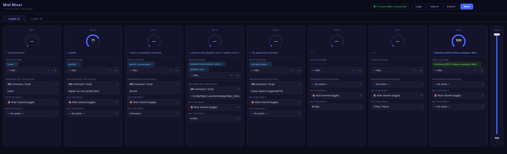

# Midi Mixer for Linux

Control your PipeWire/PulseAudio audio channels with a Behringer X-Touch Mini MIDI controller — featuring a web-based GUI to configure every knob, button, and layer.

> **Fork of [TrafeX/audio-midi-controller](https://github.com/TrafeX/audio-midi-controller)** — rewritten for PipeWire, dual-layer support, multi-app channels, and a full frontend UI.



---

## What's different from the original

| Feature | Original | This fork |
|---|---|---|
| Audio system | PulseAudio only | **PipeWire** (via `pactl`) |
| Configuration | Hardcoded in source | **Web UI + JSON config file** |
| Layers | Layer A only | **Layer A + Layer B** (independent configs) |
| Channels per knob | Single app | **Multiple apps per knob** (averaged volume) |
| Button actions | Mute only | **Mute toggle, media controls, or custom shell command** |
| Button rows | 1 row | **Encoder push + Row 1 + Row 2** (all 16 buttons configurable) |
| Audio sources | Sink inputs only | **Applications, microphone inputs, and output sinks** |
| Service | — | **systemd user service** (auto-start on login) |
| Frontend | — | Full web UI at `http://localhost:3000` |

---

## Features

- **8 knobs per layer** — each mapped to one or more audio applications, a microphone input, or an output sink
- **LED rings** reflect the real-time volume of each channel
- **16 configurable buttons per layer** — encoder push, row 1, and row 2 — each independently set to:
  - Mute/unmute toggle
  - Media control (Play/Pause, Stop, Next, Previous)
  - Any shell command or script
- **Master fader** controls the default output sink volume
- **Layer A / Layer B** — two fully independent channel configurations, switchable on the controller
- **Web UI** — configure everything from the browser: assign apps, set button actions, import/export config
- **Live status** — knob rings, mute dots, and channel names update every second

---

## Requirements

- Linux with **PipeWire** (or PulseAudio with `pactl`)
- **Behringer X-Touch Mini** in Standard mode
- **Node.js 18+** and npm
- `playerctl` for media controls — `sudo pacman -S playerctl` / `sudo apt install playerctl`
- `libasound2-dev` for the MIDI library — `sudo pacman -S alsa-lib` / `sudo apt install libasound2-dev`

---

## Installation

```bash
git clone https://github.com/regiakb/midi-mixer-linux
cd midi-mixer-linux
npm install
npm run build
node build/index.js
```

Open `http://localhost:3000` in your browser.

---

## Running as a systemd user service

Create `~/.config/systemd/user/midi-mixer.service`:

```ini
[Unit]
Description=Midi Mixer (X-Touch Mini)
After=pipewire-pulse.service sound.target
Wants=pipewire-pulse.service

[Service]
Type=simple
WorkingDirectory=/path/to/midi-mixer-linux
ExecStart=/usr/bin/node /path/to/midi-mixer-linux/build/index.js
Restart=on-failure
RestartSec=5

[Install]
WantedBy=default.target
```

```bash
systemctl --user daemon-reload
systemctl --user enable --now midi-mixer.service
```

---

## Configuration

Configuration is stored in `config.json` at the project root. It is managed from the web UI — no need to edit it manually.

```json
{
  "layerA": {
    "slots": ["brave", "spotify", ["pipewire alsa [dolphin-emu]", "dolphin-emu"], null, null, null, null, null],
    "buttonActions":     [null, null, null, null, null, null, null, null],
    "bottomRow1Actions": ["mute", "mute", "mute", null, null, null, null, null],
    "bottomRow2Actions": ["playerctl play-pause", null, null, null, null, null, null, null]
  },
  "layerB": {
    "slots": [null, null, null, null, null, null, null, null],
    "buttonActions":     [null, null, null, null, null, null, null, null],
    "bottomRow1Actions": [null, null, null, null, null, null, null, null],
    "bottomRow2Actions": [null, null, null, null, null, null, null, null]
  }
}
```

**Slot values:**
- `null` — empty slot
- `"spotify"` — matches any application whose name contains "spotify"
- `["app1", "app2"]` — matches multiple apps; volume is averaged across all matches

**Button action values:**
- `null` — no action
- `"mute"` — toggle mute on the channel
- `"playerctl play-pause"` / `"playerctl next"` / etc. — media controls
- Any other string — executed as a shell command

---

## X-Touch Mini layout (Standard mode)

```
Layer A                    Layer B
───────────────────────    ───────────────────────
Encoders:   CC 1–8         Encoders:   CC 11–18
Enc push:   Notes 0–7      Enc push:   Notes 32–39
Row 1 btns: Notes 8–15     Row 1 btns: Notes 40–47
Row 2 btns: Notes 16–23    Row 2 btns: Notes 48–55
Fader A:    CC 9           Fader B:    CC 10
```

---

## Hardware


